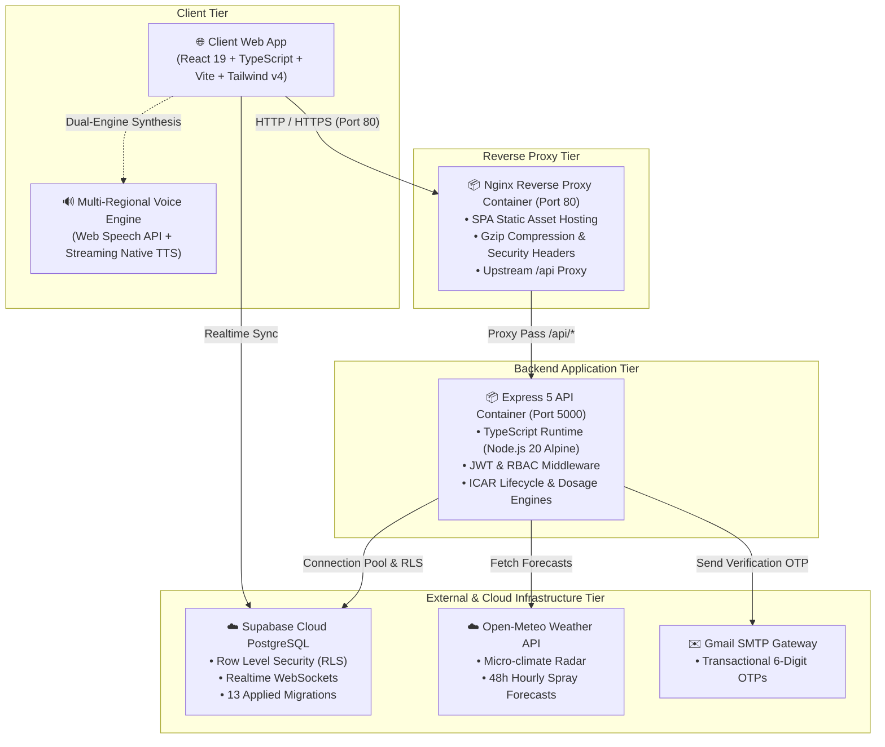

# 🌾 KrishiOra (कृषिओरा) — Precision Agritech & Farm Lifecycle Platform

<div align="center">

[](https://react.dev/)
[](https://expressjs.com/)
[](https://supabase.com/)
[](https://www.docker.com/)
[](https://tailwindcss.com/)
[](https://icar.org.in/)
[](LICENSE)

<p align="center">
  <b>Empowering Indian Farmers with ICAR-Compliant Precision Agronomy, Real-Time Micro-Climate Weather Radars, 8-Language Voice Diagnostics, and an Interactive AI Doctor Copilot ("डॉ. कृषि").</b>
</p>

[Explore Features](#-core-platform-modules) • [Docker Quickstart](#-docker--container-deployment) • [Local Development](#-local-development-setup) • [Architecture](#-system-architecture) • [API Specs](#-rest-api-reference)

---

</div>

## 📖 Table of Contents

- [🌟 Executive Overview](#-executive-overview)
- [🏗️ System Architecture](#️-system-architecture)
- [🚀 Core Platform Modules & Features](#-core-platform-modules--features)
  - [1. 🧮 ICAR Fertilizer & Seed Rate Dosage Calculator](#1--icar-fertilizer--seed-rate-dosage-calculator)
  - [2. 🌦️ Agro-Radar Spraying Safety & Farm Wellness Index](#2-️-agro-radar-spraying-safety--farm-wellness-index)
  - [3. 💰 MSP Yield & Commercial Profit / Loss Estimator](#3--msp-yield--commercial-profit--loss-estimator)
  - [4. 🛡️ Crop Stage Pest & Disease Early Warning Engine](#4-️-crop-stage-pest--disease-early-warning-engine)
  - [5. 👨‍⚕️ "डॉ. कृषि" (Krishi Doctor) Voice AI Copilot](#5-️-डॉ-कृषि-krishi-doctor-voice-ai-copilot)
- [🐳 Docker & Container Deployment](#-docker--container-deployment)
  - [1-Click Docker Compose (Production Ready)](#1-click-docker-compose-production-ready)
  - [Individual Container Builds](#individual-container-builds)
- [💻 Local Development Setup](#-local-development-setup)
- [📂 Clean Codebase Structure](#-clean-codebase-structure)
- [🔐 Environment Configuration](#-environment-configuration)
- [📡 REST API Reference](#-rest-api-reference)
- [🏛️ Agronomic & Scientific Compliance](#️-agronomic--scientific-compliance)
- [🛡️ Security, Performance & Code Quality](#️-security-performance--code-quality)
- [🤝 Contributing & Authors](#-contributing--authors)

---

## 🌟 Executive Overview

**KrishiOra** is an enterprise-grade full-stack agritech ecosystem engineered to bridge the digital and scientific divide for Indian agriculture. 

Built with modern engineering paradigms (**React 19, TypeScript 5, Express 5, Supabase PostgreSQL, and Multi-Stage Docker**), KrishiOra replaces unstructured guesswork with deterministic agronomic models backed by the **Indian Council of Agricultural Research (ICAR)** and the **Directorate of Plant Protection, Quarantine & Storage (DPPQS)**.

### Key Highlights:
- **Zero Jargon, Voice-First Interface**: Native voice synthesis & recognition in **8 Indian regional languages** (Hindi, Punjabi, Gujarati, Marathi, Bengali, Telugu, Tamil, and English).
- **Deterministic Crop Lifecycle DAG**: Automated task generation, phenological stage tracking, and weather-driven 1-click rescheduling.
- **Enterprise Containerization**: Isolated multi-stage Alpine Docker containers with Nginx reverse proxying, Gzip compression, and microservice isolation.
- **100% Type Safe & Production Audited**: 0 TypeScript compilation errors, strict schema validation, and optimized SQL transactions with Row Level Security (RLS).

---

## 🏗️ System Architecture

KrishiOra follows a decoupled, cloud-native containerized architecture:



---

## 🚀 Core Platform Modules & Features

### 1. 🧮 ICAR Fertilizer & Seed Rate Dosage Calculator
- **Scientifically Grounded**: Implements standard NPK recommendation formulas for Indian staple crops (Wheat, Paddy, Mustard, Cotton, Potato, Gram, Sugarcane, Maize).
- **Comprehensive Fertilizer Suite**:
  - **Basal Soil Application**: DAP (Di-Ammonium Phosphate), MOP (Muriate of Potash), Zinc Sulfate (ZnSO₄ 21%), and Bentonite Sulfur (90%).
  - **Top-Dress Splits**: Synchronized split Urea applications aligned with crop phenological growth stages (Crown Root Initiation, Tillering, Panicle Initiation).
- **Subsidized Economics**: Calculates exact bag counts (50kg / 45kg neem-coated urea bags) and estimates input costs using official Government subsidized MRP rates.

### 2. 🌦️ Agro-Radar Spraying Safety & Farm Wellness Index
- **Micro-Climate Telemetry**: Connects with Open-Meteo high-resolution APIs using the farm's exact latitude/longitude coordinates.
- **Spraying Safety Gauge**:
  - 🟢 **Safe Spray Window**: Wind velocity $<15\text{ km/h}$, Rain Probability $<30\%$, Ambient Temp $15^\circ\text{C}-32^\circ\text{C}$.
  - 🟡 **Caution Window**: Marginal wind/temp conditions; risk of drift or poor efficacy.
  - 🔴 **High-Risk Window**: Imminent rain ($>50\%$) or strong wind ($>20\text{ km/h}$) triggering wash-off warnings.
- **Farm Wellness Rating**: 0–100 algorithmic score factoring in moisture deficits, extreme temperature alerts, and task completion velocity.

### 3. 💰 MSP Yield & Commercial Profit / Loss Estimator
- **Government MSP Integration**: Live calculations against official 2024-25 Minimum Support Price (MSP) benchmarks per Quintal.
- **P&L Breakdown**: Harvest Revenue minus logged operational outflows (Seeds, Machinery, Fertilizer, Irrigation, Labor).
- **1-Click KCC Loan Statement Export**: Generates standardized financial balance statements formatted for **Kisan Credit Card (KCC)** banking and crop insurance approvals.

### 4. 🛡️ Crop Stage Pest & Disease Early Warning Engine
- **Stage-Synchronized Diagnostics**: Detects risks before symptoms appear based on the crop's active growth stage (e.g., Yellow Rust in Tillering Wheat, Stem Borer in Tillering Paddy).
- **8-Language Voice & Text**: Hindi, Punjabi, Gujarati, Marathi, Bengali, Telugu, Tamil, and English.
- **Knapsack Sprayer Tank Mix**: Calculates precise milliliter/gram dosage per **15-Liter Knapsack Sprayer Tank** to prevent chemical burn or under-dosing.
- **Safety & Withholding (ETL & PHI)**: Clear economic threshold levels and Pre-Harvest Intervals to prevent pesticide residue in harvested produce.

### 5. 👨‍⚕️ "डॉ. कृषि" (Krishi Doctor) Voice AI Copilot
- **Agricultural Scientist Persona**: Designed specifically for rural accessibility with an empathetic, expert doctor persona.
- **Voice-Enabled Mic Recognition**: Live Speech-to-Text with active frequency soundwave visualizer.
- **Interactive Prescription Cards**: Formats responses into structured *Symptoms*, *Chemical Prescription*, *Organic Alternative*, and *Safety Precaution* cards.
- **1-Click WhatsApp Export**: Formats the complete clinical prescription with helpline numbers for sharing with local pesticide dealers or fellow farmers.

---

## 🐳 Docker & Container Deployment

KrishiOra is fully containerized with production-grade multi-stage builds.

### 1-Click Docker Compose (Production Ready)

Start all frontend, backend, and reverse proxy containers with a single command:

```bash
# 1. Clone the repository
git clone https://github.com/mishraashutosh25/KrishiOra.git
cd KrishiOra

# 2. Setup environment variables
cp Backend/.env.example Backend/.env
cp frontend/.env.example frontend/.env
# Edit Backend/.env and frontend/.env with your Supabase credentials

# 3. Build and launch all services in detached mode
docker compose up --build -d
```

#### Access Running Services:
| Service | URL | Port | Details |
|---|---|---|---|
| **Frontend Web App** | `http://localhost` | `80` | Production Nginx SPA + API Reverse Proxy |
| **Backend API** | `http://localhost:5000/api` | `5000` | Express 5 Node.js REST API |
| **Container Health** | `docker compose ps` | - | Real-time container health status |

#### Container Lifecycle Commands:
```bash
# View live container logs
docker compose logs -f

# View logs for a specific service
docker compose logs -f backend

# Stop all containers
docker compose down

# Stop and remove all volumes
docker compose down -v
```

---

### Individual Container Builds

You can also build and run each container independently:

```bash
# Build Backend Container
docker build -t krishiora-backend:latest ./Backend
docker run -d -p 5000:5000 --env-file ./Backend/.env --name krishiora-api krishiora-backend:latest

# Build Frontend Container
docker build -t krishiora-frontend:latest ./frontend
docker run -d -p 80:80 --name krishiora-web krishiora-frontend:latest
```

---

## 💻 Local Development Setup

If you wish to develop locally with Vite Hot Module Replacement (HMR):

### Prerequisites
- **Node.js**: `v20.x` or higher
- **npm**: `v10.x` or higher
- **Supabase Account**: With PostgreSQL project created

### 1. Backend Setup
```bash
cd Backend
npm install
npm run dev
# Backend API will start on http://localhost:5000
```

### 2. Frontend Setup
```bash
cd ../frontend
npm install
npm run dev
# Frontend dev server will start on http://localhost:5173
```

### 3. Verification & Type Checking
```bash
# Run TypeScript compilation checks in both directories
cd Backend && npx tsc --noEmit
cd ../frontend && npx tsc --noEmit
```

---

## 📂 Clean Codebase Structure

```
KrishiOra/
├── Backend/                     # Node.js + Express 5 + TypeScript REST API
│   ├── src/
│   │   ├── config/              # Database pool, Supabase client, and env loader
│   │   ├── controllers/         # Farm, Crop, Expense, Weather, Lifecycle controllers
│   │   ├── middleware/          # JWT auth, validation, and AppError handlers
│   │   ├── migrations/          # 13 Versioned PostgreSQL Schema Migrations
│   │   ├── routes/              # Modular Express REST route definitions
│   │   ├── services/            # Open-Meteo weather sync, email OTP engine
│   │   └── server.ts            # Main application bootstrap
│   ├── Dockerfile               # Production multi-stage Alpine container
│   ├── .dockerignore            # Build ignore rules
│   └── package.json
│
├── frontend/                    # React 19 + TypeScript + Vite + Tailwind v4
│   ├── src/
│   │   ├── components/
│   │   │   ├── auth/            # ProtectedRoute, PublicRoute, AuthModals
│   │   │   ├── copilot/         # "डॉ. कृषि" Krishi Doctor Voice AI Copilot
│   │   │   ├── crop/            # DosageCalculatorModal, PestDiseaseAdvisorModal
│   │   │   ├── dashboard/       # AgroRadarWellness, ActiveCrops, QuickActions
│   │   │   ├── expense/         # MspProfitEstimatorModal, ExpenseSummary
│   │   │   ├── layout/          # AppLayout, TopNavbar, Sidebar, MobileNav
│   │   │   └── notifications/   # NotificationBell with Realtime WebSockets
│   │   ├── contexts/            # LanguageContext (8 Languages) & AuthContext
│   │   ├── hooks/               # Custom React hooks (useFarms, useCrops, useExpenses)
│   │   ├── pages/               # Dashboard, Farms, Crops, Expenses, Analytics, Profile
│   │   └── services/            # Axios API service clients
│   ├── nginx.conf               # High-performance Nginx reverse proxy configuration
│   ├── Dockerfile               # Multi-stage Vite builder + Nginx runner
│   ├── .dockerignore            # Build ignore rules
│   └── package.json
│
├── docker-compose.yml           # Unified multi-service Docker orchestration
├── README.md                    # Master platform documentation
└── walkthrough.md               # Technical upgrade walkthrough & system specifications
```

---

## 🔐 Environment Configuration

### `Backend/.env`
```env
# Server Configuration
PORT=5000
NODE_ENV=development

# Supabase PostgreSQL Database Credentials
SUPABASE_URL=https://your-project-id.supabase.co
SUPABASE_ANON_KEY=your-supabase-anon-key
SUPABASE_SERVICE_ROLE_KEY=your-supabase-service-role-key

# Security & Authentication
JWT_SECRET=your-super-secure-jwt-secret-key-32-chars-min

# Email OTP Service (Gmail SMTP)
SMTP_USER=your-email@gmail.com
SMTP_PASS=your-gmail-app-specific-password

# CORS Configuration
CORS_ORIGIN=http://localhost:5173,http://localhost
```

### `frontend/.env`
```env
# API & Supabase Gateway
VITE_API_BASE_URL=http://localhost:5000/api
VITE_SUPABASE_URL=https://your-project-id.supabase.co
VITE_SUPABASE_ANON_KEY=your-supabase-anon-key
```

---

## 📡 REST API Reference

| Method | Endpoint | Description | Auth Required |
|---|---|---|:---:|
| `POST` | `/api/auth/register` | Register new farmer account & dispatch OTP | ❌ |
| `POST` | `/api/auth/login` | Email/Password login & issue secure JWT | ❌ |
| `POST` | `/api/auth/verify-otp` | Verify 6-digit registration / login OTP | ❌ |
| `GET` | `/api/farms` | List all geo-mapped farms for authenticated user | ✅ |
| `POST` | `/api/farms` | Create new farm profile with soil type & acreage | ✅ |
| `GET` | `/api/lifecycle/cycles` | Fetch active crop cycles, stages & scheduled tasks | ✅ |
| `POST` | `/api/lifecycle/generate` | Generate ICAR stage schedule & DAG tasks | ✅ |
| `GET` | `/api/weather/forecast` | Retrieve Open-Meteo micro-climate agro forecast | ✅ |
| `POST` | `/api/weather/reschedule-task` | 1-Click DAG task replanning away from rain/storm | ✅ |
| `GET` | `/api/expenses/summary` | Categorized expense breakdown & totals | ✅ |
| `POST` | `/api/expenses` | Log new cultivation expense entry | ✅ |

---

## 🏛️ Agronomic & Scientific Compliance

Every algorithm, dosage formula, safety recommendation, and spray advisory in KrishiOra strictly adheres to established national and state agricultural frameworks:

1. **ICAR (Indian Council of Agricultural Research)** — Package of Practices for Field, Horticultural & Cash Crops.
2. **DPPQS (Directorate of Plant Protection, Quarantine & Storage)** — Approved Generic Molecules, Chemical Dosages, and Minimum Withholding Periods (PHI).
3. **State Agricultural Universities**:
   - **PAU (Punjab Agricultural University, Ludhiana)**
   - **CCS HAU (Chaudhary Charan Singh Haryana Agricultural University, Hisar)**
   - **TNAU (Tamil Nadu Agricultural University, Coimbatore)**
4. **Kisan Call Centre Protocol** — Toll-Free Advisory Integration (`1800-180-1551`).

---

## 🛡️ Security, Performance & Code Quality

- **Type Safety**: Full end-to-end TypeScript validation (`strict: true`) with 0 compilation errors across both client and server codebases.
- **Database Hardening**: Supabase PostgreSQL with strict Row Level Security (RLS) policies preventing cross-tenant data access.
- **Production Asset Optimization**: Vite code-splitting and asset hashing paired with Nginx Gzip compression for rapid load times over rural 3G/4G networks.
- **Fault-Tolerant Audio Engine**: Dual-layer voice synthesis with seamless fallbacks from online high-clarity streaming TTS to browser-native Web Speech API.

---

## 🤝 Contributing & Authors

Contributions, issues, and feature requests are welcome!

1. Fork the Project
2. Create your Feature Branch (`git checkout -b feature/AmazingFeature`)
3. Commit your Changes (`git commit -m 'Add some AmazingFeature'`)
4. Push to the Branch (`git push origin feature/AmazingFeature`)
5. Open a Pull Request

### 👨‍💻 Project Lead & Authors
- **[Ashutosh Mishra](https://github.com/mishraashutosh25)** — *Lead Full-Stack Agritech Architect*

---

<div align="center">

<b>🌾 KrishiOra — Built with pride for the resilient farmers of India.</b>

[](https://github.com/mishraashutosh25/KrishiOra)
[](https://github.com/mishraashutosh25/KrishiOra)

</div>